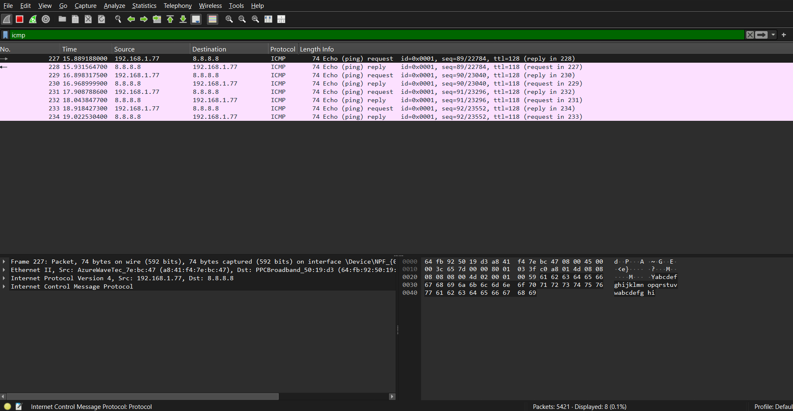
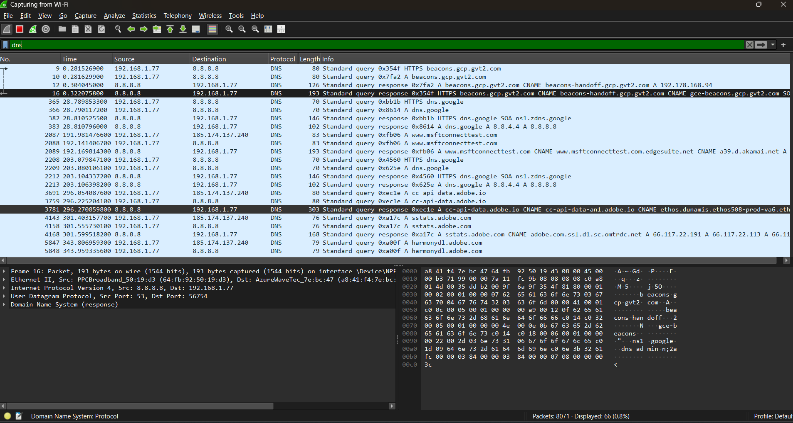
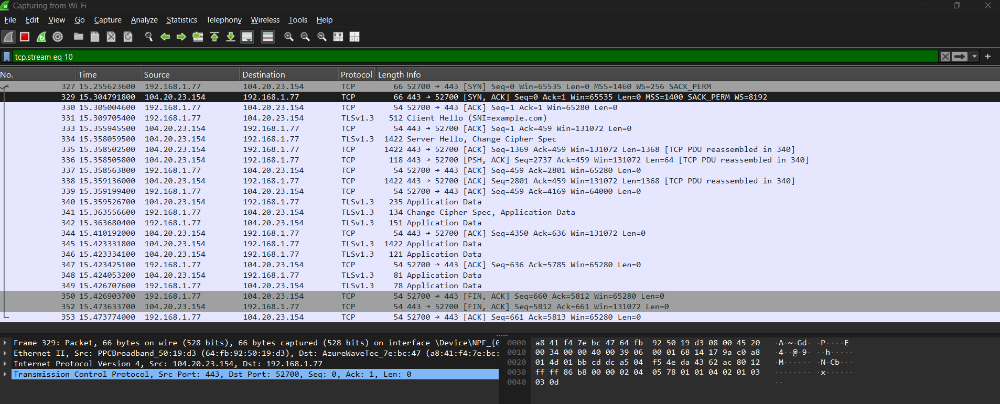

# 📅 Day 20 — Wireshark Packet Capturing Lab

## 🎯 Goal

Learn how to capture and inspect network packets using Wireshark.

Today's focus:

- Packet filtering
- ICMP packet capture
- Live DNS requests
- TCP 3-Way Handshake

---

## 📚 Topics

- Packet Capture
- Packet Filtering
- ICMP
- DNS Packets
- TCP 3-Way Handshake
- Wireshark Hands-On Lab

---

# 📦 1. What is Packet Capture?

Normally, a computer is constantly sending and receiving network packets.

```text
💻 Laptop
     ↓
 📦 Packet
     ↓
🌐 Network
     ↓
🖥️ Server
```

**Packet capture** means recording the network packets that pass through a network interface so they can be inspected.

**Wireshark** is a tool used to capture and inspect these packets.

### Simple Example

If we run:

```powershell
ping 8.8.8.8
```

The laptop sends ICMP packets:

```text
💻 Laptop
     │
     │ ICMP Echo Request
     ↓
🌐 8.8.8.8
     │
     │ ICMP Echo Reply
     ↓
💻 Laptop
```

If Wireshark is capturing at the same time, we can see these packets.

### 🧠 Easy Memory

```text
Packet
→ Data traveling through a network

Packet Capture
→ Recording those packets

Wireshark
→ Tool used to inspect captured packets
```

---

# 🔎 2. What is Packet Filtering?

Wireshark can capture many different types of packets at the same time.

For example:

```text
📦 ICMP
📦 DNS
📦 TCP
📦 UDP
📦 ARP
```

If we capture everything, it can become difficult to analyze.

A **packet filter** allows us to display only the packets we are interested in.

For Day 20, the main filters are:

```text
icmp
dns
tcp
```

---

## 2.1 ICMP Filter

Filter:

```text
icmp
```

This displays ICMP packets.

We use this while running:

```powershell
ping 8.8.8.8
```

Simple flow:

```text
ping
  ↓
ICMP
  ↓
Wireshark filter: icmp
```

---

## 2.2 DNS Filter

Filter:

```text
dns
```

This displays DNS-related packets.

Example:

```text
google.com
     ↓
    DNS
     ↓
IP Address
```

---

## 2.3 TCP Filter

Filter:

```text
tcp
```

This displays TCP packets.

This is important because we use it to inspect the TCP 3-Way Handshake:

```text
SYN
 ↓
SYN-ACK
 ↓
ACK
```

### 🧠 Easy Memory

```text
icmp
→ Show ICMP traffic

dns
→ Show DNS traffic

tcp
→ Show TCP traffic
```

---

# 📡 3. What is ICMP?

**ICMP = Internet Control Message Protocol**

ICMP is a protocol used by network devices to send control and diagnostic messages.

The easiest example is `ping`.

When we run:

```powershell
ping 8.8.8.8
```

the computer uses ICMP to check whether the destination can respond.

### What Happens?

```text
💻 Laptop
     │
     │ ICMP Echo Request
     ↓
🌐 8.8.8.8
     │
     │ ICMP Echo Reply
     ↓
💻 Laptop
```

### ICMP Messages

**Echo Request**

> "Are you reachable?"

**Echo Reply**

> "Yes, I can respond."

### 🧠 Remember

```text
ICMP
↓
Network control / diagnostic messages

ping
↓
Uses ICMP

Wireshark filter
↓
icmp
```

---

# 🌐 4. DNS Packets

DNS was already studied in **Day 16**.

Today, the focus is on seeing DNS traffic inside Wireshark.

## What is DNS?

**DNS = Domain Name System**

DNS helps translate a domain name into an IP address.

Example:

```text
google.com
     ↓
    DNS
     ↓
IP Address
```

### DNS Communication

```text
💻 Laptop
     │
     │ DNS Query
     │ "What is the IP of google.com?"
     ↓
🌐 DNS Server
     │
     │ DNS Response
     │ "Here is the IP."
     ↓
💻 Laptop
```

In Wireshark, we can use:

```text
dns
```

to display DNS packets.

### 🧠 Remember

```text
DNS
→ Domain name → IP address

Wireshark
→ Lets us see DNS traffic

Filter
→ dns
```

---

# 🔗 5. TCP 3-Way Handshake

## What is TCP?

**TCP = Transmission Control Protocol**

Before TCP communication begins, the two devices establish a connection.

TCP uses a **3-Way Handshake**.

```text
SYN
 ↓
SYN-ACK
 ↓
ACK
```

---

## 5.1 Step 1 — SYN

The client sends a **SYN** packet to request a connection.

```text
💻 Laptop
     │
     │ SYN
     ↓
🖥️ Server
```

Meaning:

> "Can we establish a connection?"

---

## 5.2 Step 2 — SYN-ACK

The server responds with **SYN-ACK**.

```text
💻 Laptop
     ↑
     │ SYN-ACK
     │
🖥️ Server
```

Meaning:

> "Yes, I received your request and I'm ready."

---

## 5.3 Step 3 — ACK

The client sends **ACK**.

```text
💻 Laptop
     │
     │ ACK
     ↓
🖥️ Server
```

Meaning:

> "Okay, understood."

The TCP connection is now established.

### 🧠 TCP 3-Way Handshake Memory

```text
1️⃣ SYN
   Client → Server

2️⃣ SYN-ACK
   Server → Client

3️⃣ ACK
   Client → Server
```

### Easy Memory

```text
SYN → SYN-ACK → ACK
```

---

# 🧪 6. Hands-On Lab — Wireshark

## Step 1 — Start Packet Capture

Opened Wireshark and started capturing traffic from the active **Wi-Fi interface**.

---

## 🧪 Lab 1 — ICMP Packet Capture

### Command Used

```powershell
ping 8.8.8.8
```

### Wireshark Filter

```text
icmp
```

### Observation

Wireshark captured ICMP Echo Request and Echo Reply packets.

Example:

```text
192.168.1.77 → 8.8.8.8
ICMP Echo (ping) request

8.8.8.8 → 192.168.1.77
ICMP Echo (ping) reply
```

### Result

Successfully captured and inspected ICMP traffic generated by `ping`.

### 📸 Screenshot



---

## 🧪 Lab 2 — Live DNS Packet Capture

### Command Used

```powershell
nslookup google.com
```

### Wireshark Filter

```text
dns
```

### Observation

Wireshark captured DNS queries and responses.

Example:

```text
192.168.1.77 → 8.8.8.8
DNS Query

8.8.8.8 → 192.168.1.77
DNS Response
```

The capture also showed DNS records such as:

```text
A
CNAME
```

### Result

Successfully captured and inspected live DNS traffic using Wireshark.

### 📸 Screenshot



---

## 🧪 Lab 3 — TCP 3-Way Handshake

### Wireshark Filter

```text
tcp
```

To identify SYN packets, the following filter was also used:

```text
tcp.flags.syn == 1
```

A TCP conversation was then isolated using the TCP conversation filter.

### Captured TCP Connection

The successful TCP connection captured in Wireshark was:

**Client**

```text
192.168.1.77:52700
```

**Server**

```text
104.20.23.154:443
```

---

### 1️⃣ SYN

```text
192.168.1.77:52700
        ↓
104.20.23.154:443

[SYN]
```

The laptop requested a TCP connection to the server.

---

### 2️⃣ SYN-ACK

```text
104.20.23.154:443
        ↓
192.168.1.77:52700

[SYN, ACK]
```

The server responded and acknowledged the connection request.

---

### 3️⃣ ACK

```text
192.168.1.77:52700
        ↓
104.20.23.154:443

[ACK]
```

The laptop sent the final acknowledgement.

The TCP connection was successfully established.

---

### Complete TCP Handshake

```text
💻 192.168.1.77                 🖥️ 104.20.23.154

       ─────── SYN ───────────────→

       ←──── SYN + ACK ────────────

       ─────── ACK ───────────────→

          ✅ TCP Connection
             Established
```

After the TCP handshake, the capture showed **TLSv1.3** traffic, including:

```text
Client Hello
Server Hello
Application Data
```

### 📸 Screenshot



---

# 📊 7. Hands-On Lab Summary

| Lab | Filter / Command | Result |
|---|---|---|
| ICMP Capture | `ping 8.8.8.8` + `icmp` | ✅ Successful |
| DNS Capture | `nslookup google.com` + `dns` | ✅ Successful |
| TCP Capture | `tcp` | ✅ Successful |
| TCP Handshake | `tcp.flags.syn == 1` | ✅ Successful |
| Complete Handshake | TCP conversation filter | ✅ SYN → SYN-ACK → ACK |

---

# 🧠 8. Day 20 Quick Revision

## Packet Capture

```text
Record network packets
        ↓
Inspect them using Wireshark
```

## Packet Filtering

```text
icmp → ICMP traffic
dns  → DNS traffic
tcp  → TCP traffic
```

## ICMP

```text
ping
 ↓
ICMP Echo Request
 ↓
ICMP Echo Reply
```

## DNS

```text
Domain Name
 ↓
DNS Query
 ↓
DNS Response
 ↓
IP Address
```

## TCP 3-Way Handshake

```text
SYN
 ↓
SYN-ACK
 ↓
ACK
 ↓
Connection Established
```

---
