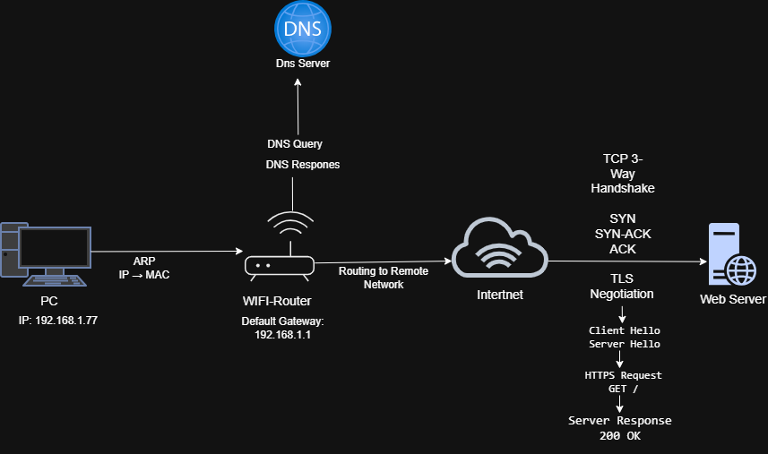

# 📅 Day 21 — How the Internet Works

## 🎯 Goal

Create a complete architectural write-up showing how a request travels from a client laptop to an external web server.

Today's project combines the networking concepts learned during the previous days:

- MAC addressing
- ARP
- IP addressing
- Routing
- Default Gateway
- DNS
- TCP 3-Way Handshake
- TLS
- HTTPS / HTTP
- Server Response

---

# 📚 Topics

- Technical Documentation
- System Tracing
- Architectural Flow
- MAC Routing
- IP Addressing
- DNS Lookup
- TCP Handshake
- TLS Negotiation
- HTTP/HTTPS Retrieval

---

# 🏗️ 1. Project Architecture

The following diagram shows the complete journey of a request from my laptop to an external web server.

### 📸 Architecture Diagram



---

# 💻 2. Client Laptop

The journey starts from my laptop.

My laptop has the local IP address:

```text
192.168.1.77
```

The laptop needs to communicate with devices on the local network and with remote networks on the Internet.

---

# 🔗 3. ARP — IP Address to MAC Address

Before the laptop sends an Ethernet frame to the local router, it needs to know the router's MAC address.

The laptop knows the router's IP address:

```text
192.168.1.1
```

This is the **Default Gateway**.

The laptop uses **ARP (Address Resolution Protocol)** to discover the MAC address associated with the gateway IP.

### ARP Flow

```text
💻 Laptop
192.168.1.77
      │
      │ ARP Request
      │ "Who has 192.168.1.1?"
      ↓
📡 Wi-Fi Router
192.168.1.1
      │
      │ ARP Reply
      │ "192.168.1.1 is at [MAC Address]"
      ↓
💻 Laptop
```

### 🧠 Key Concept

```text
ARP
→ IP Address → MAC Address
```

The actual MAC address is not included in this project because it was not required for the architecture diagram.

---

# 🌐 4. IP Addressing

My laptop uses:

```text
IP Address:
192.168.1.77
```

The local router / Default Gateway is:

```text
192.168.1.1
```

The laptop uses the local network to communicate with the router.

If the destination is outside the local network, the packet is sent toward the **Default Gateway**.

---

# 🚪 5. Default Gateway and Routing

The router acts as the **Default Gateway** for the laptop.

The laptop's routing information showed:

```text
Destination: 0.0.0.0
Netmask:     0.0.0.0
Gateway:     192.168.1.1
Interface:   192.168.1.77
```

The default route means:

> If there is no more specific route for the destination, send the traffic to the Default Gateway.

### Simplified Flow

```text
💻 Laptop
192.168.1.77
      │
      │ Local Network
      ↓
📡 Wi-Fi Router
192.168.1.1
      │
      │ Routing to Remote Network
      ↓
🌐 Internet
```

---

# 🔎 6. DNS Lookup

Before connecting to a website, the client needs the IP address of the destination server.

DNS stands for:

**Domain Name System**

DNS translates a domain name into an IP address.

Example:

```text
google.com
     ↓
    DNS
     ↓
IP Address
```

### DNS Communication

```text
💻 Laptop
      │
      │ DNS Query
      │ "What is the IP address?"
      ↓
🔎 DNS Server
      │
      │ DNS Response
      │ "Here is the IP address."
      ↓
💻 Laptop
```

In the Day 20 Wireshark lab, live DNS traffic was captured and inspected.

The Wireshark filter used was:

```text
dns
```

---

# 🌐 7. Remote Network Routing

After the laptop learns the destination IP address, it needs to reach the remote server.

The laptop checks its routing information.

Because the destination is outside the local network, the traffic is sent to:

```text
Default Gateway
192.168.1.1
```

The router then forwards the traffic toward the remote network.

Simplified:

```text
💻 Laptop
      ↓
📡 Default Gateway
      ↓
🌐 Internet
      ↓
🖥️ Web Server
```

---

# 🤝 8. TCP 3-Way Handshake

Before TCP communication begins, the client and server establish a TCP connection.

TCP uses a **3-Way Handshake**.

```text
SYN
 ↓
SYN-ACK
 ↓
ACK
```

---

## 8.1 SYN

The client sends a SYN packet to request a TCP connection.

```text
💻 Client
      │
      │ SYN
      ↓
🖥️ Server
```

Meaning:

> "Can we establish a connection?"

---

## 8.2 SYN-ACK

The server responds with SYN-ACK.

```text
💻 Client
      ↑
      │ SYN-ACK
      │
🖥️ Server
```

Meaning:

> "I received your request and I'm ready."

---

## 8.3 ACK

The client sends the final ACK.

```text
💻 Client
      │
      │ ACK
      ↓
🖥️ Server
```

The TCP connection is now established.

### 🧠 Easy Memory

```text
SYN → SYN-ACK → ACK
```

---

# 🦈 9. TCP Handshake Observed in Wireshark

During the Day 20 Wireshark lab, a successful TCP connection was captured.

### Client

```text
192.168.1.77:52700
```

### Server

```text
104.20.23.154:443
```

### Captured Flow

```text
192.168.1.77:52700
        │
        │ SYN
        ↓
104.20.23.154:443
        │
        │ SYN-ACK
        ↓
192.168.1.77:52700
        │
        │ ACK
        ↓
104.20.23.154:443
```

### Complete Handshake

```text
💻 192.168.1.77                 🖥️ 104.20.23.154

       ─────── SYN ───────────────→

       ←──── SYN + ACK ────────────

       ─────── ACK ───────────────→

          ✅ TCP Connection
             Established
```

---

# 🔐 10. TLS Negotiation

After the TCP connection is established, TLS negotiation takes place for secure HTTPS communication.

The Wireshark capture showed TLSv1.3 traffic.

Important messages observed included:

```text
Client Hello
Server Hello
```

Simplified flow:

```text
TCP Connection
      ↓
TLS Negotiation
      ↓
Client Hello
      ↓
Server Hello
      ↓
Secure Communication
```

TLS helps secure communication between the client and server.

---

# 🌍 11. HTTPS Request

After the connection and TLS negotiation, the browser can communicate with the web server using HTTPS.

A simplified request is:

```text
GET /
```

The browser is requesting a resource from the web server.

```text
💻 Browser
      │
      │ HTTPS Request
      │ GET /
      ↓
🖥️ Web Server
```

---

# 📦 12. Server Response

The web server processes the request and sends a response back to the client.

A successful HTTP response can be:

```text
200 OK
```

Simplified flow:

```text
💻 Browser
      │
      │ GET /
      ↓
🖥️ Web Server
      │
      │ 200 OK
      │ Response
      ↓
💻 Browser
```

The browser can then display the requested web content.

---

# 🔄 13. Complete Internet Request Flow

Putting everything together:

```text
💻 Client Laptop
IP: 192.168.1.77
        │
        │
        │ ARP
        │ IP → MAC
        ↓
📡 Wi-Fi Router
Default Gateway:
192.168.1.1
        │
        │ Routing to Remote Network
        ↓
🌐 Internet
        │
        │ DNS Lookup
        ↓
🔎 DNS Server
        │
        │ DNS Response
        ↓
🌐 Destination IP
        │
        │ TCP 3-Way Handshake
        │ SYN
        │ SYN-ACK
        │ ACK
        ↓
🔐 TLS Negotiation
        │
        │ Client Hello
        │ Server Hello
        ↓
🌍 HTTPS Request
        │
        │ GET /
        ↓
🖥️ Web Server
        │
        │ 200 OK
        │ Server Response
        ↓
💻 Client Browser
```

---

# 🧠 14. Complete Flow — Easy Revision

```text
1️⃣ Laptop
      ↓
2️⃣ ARP
      ↓
3️⃣ Default Gateway
      ↓
4️⃣ Routing
      ↓
5️⃣ DNS Lookup
      ↓
6️⃣ Destination IP
      ↓
7️⃣ TCP Handshake
      ↓
   SYN
   SYN-ACK
   ACK
      ↓
8️⃣ TLS Negotiation
      ↓
9️⃣ HTTPS Request
      ↓
🔟 Web Server
      ↓
1️⃣1️⃣ 200 OK Response
      ↓
💻 Browser
```

---

# 📊 15. Technologies Used

| Technology | Purpose |
|---|---|
| ARP | Maps IP address to MAC address on the local network |
| IP | Provides logical addressing |
| Routing | Determines where packets should go |
| Default Gateway | Provides a path to remote networks |
| DNS | Resolves domain names to IP addresses |
| TCP | Establishes a reliable connection |
| TLS | Secures communication |
| HTTPS | Secure web communication |
| HTTP | Transfers web requests and responses |

---

# 🧪 16. Project Work Completed

### Architecture

- ✅ Created the complete Internet architecture diagram using Draw.io
- ✅ Added client laptop
- ✅ Added Wi-Fi router
- ✅ Added DNS server
- ✅ Added Internet
- ✅ Added web server
- ✅ Added ARP flow
- ✅ Added IP addressing
- ✅ Added routing
- ✅ Added TCP 3-Way Handshake
- ✅ Added TLS negotiation
- ✅ Added HTTPS request
- ✅ Added server response

### Previous Hands-On Evidence Used

- ✅ ARP lab from Day 17
- ✅ Routing table analysis from Day 19
- ✅ DNS packet capture from Day 20
- ✅ TCP 3-Way Handshake capture from Day 20
- ✅ TLS traffic observed in Wireshark

---

# 📸 17. Architecture Diagram

The final architecture diagram created in Draw.io:


---
